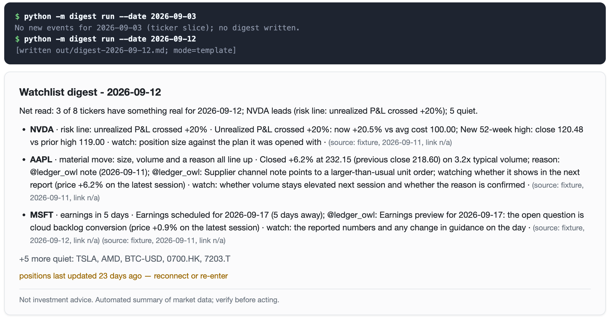
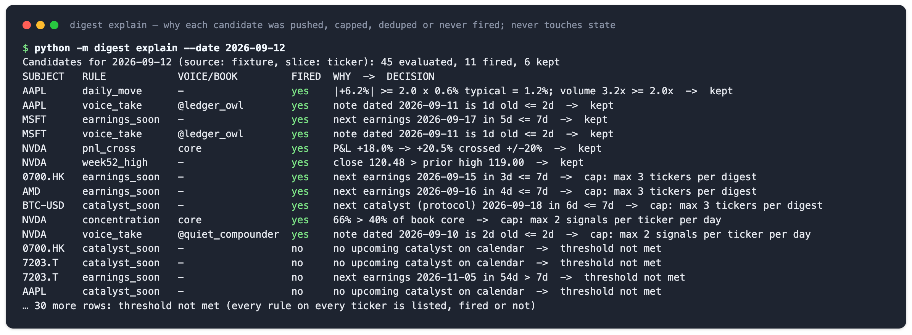

# ticker-digest

[中文](README.zh.md)

An event-driven alert engine for **US-equity and crypto investors**.

**When it applies.** Some investors do not watch the tape all day; they act when something happens: an earnings release, a one-day jump or drop, an open position crossing a stop line, a note from an account they follow. What they want is not a daily market summary but "speak only when there is a reason, stay quiet otherwise". That is what this repository does: it turns a watchlist, a set of positions and a list of followed accounts into one set of signals, pushes one short sourced digest only when an event fires, and folds every other name into a single "N quiet" line.

**Who it is for.** Individual investors who keep their own watchlist and positions; product and content people building alert-style pushes who want "what to push, what not to push, and why not" working before anything else; developers who want to plug in their own data source.

**Scope and limits.** Real-time triggers cover US equities and crypto only; HK, JP, KR and other markets run on earnings and catalyst calendars. It is not a market dashboard, it does not place orders with a broker, and it gives no buy or sell advice. The default demo runs fully offline; prices, calendars, positions and account handles are all synthetic.

## What you get (preview)

Two runs on the synthetic sample, one quiet day and one eventful day. On the quiet day the command prints one line and writes no file. On the eventful day it writes one Markdown digest: a one-line net read, one line per name that has something (judgment, why, what to watch, source and data date), and the rest folded into "+5 more quiet".



When you want to know why something was or was not pushed, `explain` lists every rule on every ticker, whether it fired, and what the policy did with it: kept, capped, deduped, or below threshold.



The same candidate set can be sliced by account (`--slice person`, grouped under `## @handle`) or by book (`--slice book`, grouped under `## core` / `## crypto`); the Quickstart below runs all three.

## Five ways it differs from an ordinary market digest

A broker's or market app's "daily digest" is an aggregation: one per day, one paragraph per ticker, sent whether or not anything happened. It fails in two ways: late (by the time you read it, systematic traders have already moved) and too frequent (users mute it). This engine does the opposite in five places:

1. **No event, no push, and an attention budget.** Only content that trips a threshold, survives the caps and the dedupe, and passes the output contract gets written; at most 2 items per ticker per day and 3 tickers per digest, everything else folded into one `+N more quiet` line. On a day with no push, the audit file says why.
2. **One set of signals, many slices.** The same batch of candidates is sliced by ticker into a watchlist digest, by book into a portfolio digest, by account into an opinion digest, without a separate scraper per digest type.
3. **Re-push only when it gets worse.** The same event is not repeated within 7 days; it is pushed again only when its severity rises by a step and a minimum interval has passed. Improvement is never a reason to re-push.
4. **With positions, rank by position.** Risk lines (P&L crossing, concentration) come before pure price, then `weight × move`; only without positions does event priority decide.
5. **A hard gate before sending; the LLM only polishes.** Every line must carry a source, a data date and a link; advice wording and technical-analysis jargon are forbidden; an LLM rewrite is re-checked against the same contract and falls back to the template on any violation.

## Quickstart

Requires Python 3.9+, `PyYAML` and `requests` (the `anthropic` package is optional). Every command below runs offline against the synthetic sample under `data/`.

```bash
pip install -e .                                   # or: pip install pyyaml requests
python -m unittest discover -s tests               # test suite

# A quiet pair of days: the first run pushes one risk line, the next day has nothing new -> no file
python -m digest run --date 2026-09-02
python -m digest run --date 2026-09-03            # "No new events for 2026-09-03 (ticker slice); no digest written."

# An eventful day: the same candidate set sliced three ways
python -m digest run --date 2026-09-12                    # watchlist digest (by ticker)
python -m digest run --date 2026-09-12 --slice person     # opinion digest (by person / handle)
python -m digest run --date 2026-09-12 --slice book       # portfolio digest (by book)

python -m digest run --date 2026-09-12                    # same-day re-run: delivered items are deduped, capped leftovers go out (incl. a [calendar-only] name)
python -m digest explain --date 2026-09-12                # every candidate: threshold check + policy decision; never touches state
python -m digest reset-state
```

The second day produces one line on stdout and no file. The eventful day writes the digest shown in the preview above; the raw Markdown is here for anyone who wants the exact format.

<details>
<summary>Raw Markdown of the 2026-09-12 watchlist digest (template mode)</summary>

```
# Watchlist digest - 2026-09-12

Net read: 3 of 8 tickers have something real for 2026-09-12; NVDA leads (risk line: unrealized P&L crossed +20%); 5 quiet.

- **NVDA** · risk line: unrealized P&L crossed +20% · Unrealized P&L crossed +20%: now +20.5% vs avg cost 100.00; New 52-week high: close 120.48 vs prior high 119.00 · watch: position size against the plan it was opened with · (source: fixture, 2026-09-11, link n/a)
- **AAPL** · material move: size, volume and a reason all line up · Closed +6.2% at 232.15 (previous close 218.60) on 3.2x typical volume; reason: @ledger_owl note (2026-09-11); ... · watch: whether volume stays elevated next session and whether the reason is confirmed · (source: fixture, 2026-09-11, link n/a)
- **MSFT** · earnings in 5 days · Earnings scheduled for 2026-09-17 (5 days away); @ledger_owl: Earnings preview ... · watch: the reported numbers and any change in guidance on the day · (source: fixture, 2026-09-12, link n/a) (source: fixture, 2026-09-11, link n/a)

+5 more quiet: TSLA, AMD, BTC-USD, 0700.HK, 7203.T

positions last updated 23 days ago — reconnect or re-enter

---
Not investment advice. Automated summary of market data; verify before acting.
```

</details>

The opinion digest groups by handle (`## @ledger_owl` followed by the tickers it mentioned), the portfolio digest groups by book (`## core`, `## crypto`); all three come from the same candidate set. `run` writes `out/digest-<date>[-<slice>].md` (a repeat run on the same day gets a `-2`, `-3` … suffix) and records state. `--date` is the run date; each ticker uses its latest bar on or before that date, so a Saturday run digests Friday's close and cites Friday's date. `--now YYYY-MM-DDTHH:MM` pins the wall clock (dedupe intervals are measured against it), for demos and tests.

Online mode `--source stooq` fetches free daily CSVs from stooq.com (no key). Stooq has no earnings endpoint, so the calendar still comes from `data/earnings_calendar.csv` (cited as `local-calendar`) and voice notes from `data/voices.csv` (cited as `local-notes`). Any network or payload problem degrades to "no data for that ticker" with a warning (`-v` shows them) rather than an exception. Stooq sometimes serves a browser-verification page to scripted clients; the adapter detects it and reports it honestly, and does not try to work around the check.

LLM polish is enabled automatically when `ANTHROPIC_API_KEY` is set and the `anthropic` package is installed (`pip install -e ".[llm]"`); model `claude-sonnet-5`. `--no-llm` forces template mode. The rewrite is re-validated by the same contract and falls back to the template on API errors or violations.

## How it works

```
data/ bars · earnings calendar · account notes · positions     watchlist.yaml tickers · books · thresholds · policy
            │                                                          │
            ▼                                                          ▼
1 signals   digest/signals.py    every rule on every ticker; a candidate whether it fired or not (why, fingerprint, severity)
2 slices    digest/slices.py     group by ticker / account / book; decide the "quiet" universe
3 ranking   digest/policy.py     risk lines → weight × move → event priority; caps, dedupe, escalation
4 render    digest/render.py     one net read + one line per ticker; digest/contract.py re-checks as a hard gate
5 delivery  run / propose+publish  writes out/digest-<date>[-slice].md; the human path proposes first, then publishes ticked items
6 audit     digest/audit.py      state/audit/<date>.json: every candidate's decision, dedupe hits, why_no_push
```

`run` goes through 1 to 6; `explain` stops after 3 and prints every candidate's threshold check and policy decision without touching state.

## Design decisions

This repository is a from-scratch, generalised rewrite of what I worked out while building a watchlist and portfolio digest at my previous company. These are the decisions that matter and where they came from.

**Why "one set of signals, many slices".** The signal layer only produces candidates, each with its threshold check and a fingerprint; the same batch can be sliced by ticker, by book or by person into three digests. This is the abstraction I most wanted to keep: the kinds of digest change, the definition of a signal does not, so fetching and rules are written once.

**Why the ranking works this way.** With positions, rank by weight times move and put risk lines ahead of pure price; without positions, rank by event priority. Freshness comes from fingerprint dedupe: the same event is not repeated within 7 days and only re-pushed when it worsens. In the prototype I measured 5 near-identical alerts in one hour and 16 pushes against 3 silences in a day before adding "re-push the same topic only on worsening, plus a minimum interval".

**Why the rendering works this way.** First a one-line net read, then one line per ticker: judgment, why, what to watch, source. No buy or sell, no price targets, no technical-indicator jargon; every item carries its source and data date; the LLM only polishes, the rewrite is re-checked against the same contract, and on failure the template is used. Each rule was paid for with a mistake: when the prototype went live the output was unstable, the screen filled with tool narration, and splitting sections by dimension made the same ticker appear repeatedly. It was solved by a hard gate before sending, not by prompt wording.

**Why not real-time for every market.** Real-time triggers cover US equities and crypto; other markets run on the earnings and catalyst calendar. The reason is cost, not capability: real-time data for those exchanges is expensive. When a market's feed is connected, flip it to `realtime` and no rule changes.

**Position freshness.** Of the three ways to connect positions (manual entry, screenshot, broker link) the first two are static snapshots, so at the right moment the user is told "this item used positions from 14 days ago".

**The digest is the baseline; the single push is the product.** In the ad data, digest-style aggregation pages converted worst. What users actually open a notification for is the one line on the day something happens, not the daily summary. That is why "no event, no push" is the first principle of the whole repository.

## Signals and thresholds

The signal layer runs every rule for every ticker and **always emits a candidate, fired or not** (with a one-line `why`), which is how `explain` and the audit file can show the threshold checks that did not trigger. Every `Signal` is one cell of the signal matrix: it always has a `subject` (the ticker), optionally a `voice` (handle / person) and a `book` (portfolio id); plus a `fingerprint` (dedupe identity), a `severity` (magnitude used by the escalation-aware dedupe), `judgment` / `watch` (the rendered judgment and what to watch) and a `link` (citation URL, or `link n/a` when none exists).

| Rule | Trigger | Fingerprint | Severity |
|---|---|---|---|
| `daily_move` | \|move\| ≥ `move_k` × the ticker's typical (median) daily move over the last `typical_window` sessions, **and** volume ≥ `volume_multiple` × the trailing `volume_window`-session average; falls back to the absolute `move_pct` when fewer than `typical_window` sessions exist | ticker + data date | \|move %\| |
| `volume_spike` | volume ≥ `volume_multiple` × the average; folded into `daily_move` when that fired on the same bar, so it is not pushed on its own | ticker + data date | ratio |
| `week52_high` / `week52_low` | close outside the range of the last `week52_window` sessions | ticker | % beyond the range |
| `earnings_soon` / `catalyst_soon` | a calendar earnings / catalyst within `earnings_days`; any calendar row whose `kind` is not `earnings` is a catalyst | ticker + event date | fixed at zero (calendar events never "worsen"; each event is pushed once) |
| `pnl_cross` | unrealized P&L **crosses** ±`pnl_pct` (a crossing, not a level, so it fires once); carries `book` | ticker + side | \|P&L %\| |
| `concentration` | one position exceeds `concentration_pct` of its book's value; books with a single position are not evaluated; carries `book` | ticker + book | share % |
| `voice_take` | a note in `data/voices.csv` by a tracked handle about a watchlist ticker, at most `note_days` old; carries `voice` and `link` | ticker + handle + date | zero |

**Grade of price-class signals.** Triggering is only the gate; `daily_move` is graded `material` only when move, volume and an attributable reason all hold (higher priority, judgment reads *material move*), otherwise `unattributed` (judgment reads *no attributable reason found*, and the thing to watch is whether a reason surfaces). Reasons are searched in order: a handle note within `reason_days` → a calendar event within `reason_days` → a sector proxy (another member of the same `sectors` group moved the same way and tripped its own trigger).

The sample data has 300 sessions per ticker (far more than `typical_window`), generated with a fixed seed by `scripts/make_sample_data.py`, which re-runs the package's own rules and asserts the scenario: the last bar is engineered so that AAPL jumps on volume with a same-day note from a fictional handle (→ material), NVDA makes a new high and its P&L crosses the line, book `core` is over its concentration limit, AMD / MSFT / 0700.HK have earnings coming up and BTC-USD has a catalyst. Regenerating after a rule change fails loudly if the scenario drifts.

## Slices and ranking

`--slice` decides how one candidate set is grouped, ranked, and what counts as "quiet":

| Slice | Group key | Which signals | Universe behind `+N more quiet` |
|---|---|---|---|
| `ticker` (default, watchlist digest) | ticker | all | `tickers` |
| `person` (opinion digest) | `voice` | only signals with a `voice` (handle notes) | every handle seen in `voices.csv` |
| `book` (portfolio digest) | `book` | position signals carry their own book; price / calendar signals join every book that holds the ticker | every held ticker |

Ranking has two levels. **Lines inside a group**: the `book` slice is position-aware — names with a risk line (`pnl_cross`, `concentration`) come first, then `weight × |move|` (weight = the name's share of the book's value, move = the latest bar's change), then event priority; the other slices rank by event priority (`pnl_cross` / material move > move > new high/low / earnings / catalyst > volume / opinion > concentration). **Groups against each other**: by their strongest line, then by the group's total weight, ties by name. The caps are counted per slice too: `max_signals_per_ticker` means "per group key per day" (per handle per day in the opinion digest) and `max_tickers_per_digest` means "groups per digest" (books, in the portfolio digest).

The three digests are three independent deliveries; `state/sent.json` is namespaced per slice, so a note delivered in the opinion digest does not count as "already sent" for the watchlist digest.

**Position freshness.** `positions.updated_at` is the date of the positions snapshot. When a digest used positions (the `book` slice, or any slice that delivered a signal carrying a `book`) and the snapshot is older than `positions_stale_days`, the footer gains one line: `positions last updated N days ago — reconnect or re-enter`. Manually entered and screenshot-imported positions are static snapshots; that line exists for them.

## Rendering contract (what to write, what not to write)

The template is fixed: title → one-line **net read** (how many names have something, who leads, how many are quiet) → **one line per name** (`**NAME** · judgment · why · watch: what to watch · source`; several signals for one name fold into the same line, facts joined by semicolons, no citation dropped) → at most `max_lines_per_digest` lines → `+N more quiet: …` → the optional positions footer → the disclaimer. The `person` and `book` slices put a `## group` header above their lines; names on calendar-tier markets carry `[calendar-only]`.

`digest/contract.py` is the hard gate before anything is written, and the template output and the LLM rewrite go through the **same validator**:

- **What to write**: every bullet ends with one or more `(source: <name>, YYYY-MM-DD, <URL or link n/a>)` — source, data date and link are all required; the link is either a URL the data actually carried or the literal `link n/a`. The template hands the validator the set of links its signals carry, so any URL in a rewrite that is not in that set is rejected as fabricated. The disclaimer must be present verbatim.
- **What not to write**: recommendation wording — buy / sell / should / price target / guaranteed and the like (`FORBIDDEN_PHRASES`) — and technical-analysis jargon (`TA_JARGON`: RSI, MACD, golden/death cross, Bollinger, Fibonacci, support/resistance, breakout, oversold/overbought, head and shoulders, moving average, candlestick patterns, divergence, trendline, …). Matching is whole-word, so buyback, resell or average are not caught.
- **The LLM only polishes**: the system prompt asks it to keep the net read, one line per name, every citation and the disclaimer verbatim, and to add no facts, numbers, links or opinions. The result still goes through the contract; any violation, API error or abnormal stop reason falls back to the template.

## Delivery, dedupe and approval

**Delivery.** `run` is the automatic path: evaluate → policy → render → write to `out/` → record state → write the audit. With no surviving candidate it prints one line and writes no file. The rendered Markdown is the deliverable; wiring an IM or e-mail channel means sending the file from `out/`. The repository ships no real webhook.

**Dedupe (escalation-aware).** Each signal's fingerprint defines "the same thing"; state stores fingerprint → {time pushed, severity, group}. Two gates:

1. **Identity dedupe**: the same fingerprint is not pushed again within `dedupe_days` — unless it **worsened**: severity at least `escalation_pp` above the last push, and at least `min_interval_minutes` since it. Improvement is never a reason to re-push.
2. **Same-topic burst guard**: a fingerprint without its detail part is the topic (`ticker:rule`). If the topic was pushed within `escalation_window_hours` (even with a different detail, e.g. an intraday re-run that rolled the date), it is again only re-pushed when it worsened and the minimum interval passed.

Signals cut by `max_tickers_per_digest` are delivered on the next run; signals cut by the daily budget wait for the next day. The DECISION column of `explain` and `dedupe_hits` in the audit spell out the numbers behind every `dedupe: …` and `escalation: …`.

**Approval.** Next to the automatic path there is a human-review path:

```bash
python -m digest propose --date 2026-09-12              # writes out/proposals/2026-09-12.md: every candidate over its threshold + what policy would do
# edit the file: change "- [ ]" to "- [x]" on the items to send
python -m digest publish --date 2026-09-12 --approved            # renders only ticked items; --dry is the default: no file, no state
python -m digest publish --date 2026-09-12 --approved --send     # actually deliver
python -m digest publish --date 2026-09-12                       # without --approved: the policy result, still dry by default
```

The proposal lists only candidates that crossed a threshold (there is nothing to approve otherwise) but includes items the caps or the dedupe would have dropped: ticking one is the explicit human override. `publish --approved` exits with an error when there is no proposal file.

## Multi-market tiers

`markets` in `watchlist.yaml` puts each market in one of two tiers, `realtime` or `calendar`; the market is inferred from the ticker suffix (`.HK` → HK, `.T`/`.JP` → JP, `.KS`/`.KQ`/`.KR` → KR, `-USD` → CRYPTO, anything else → US), and markets not listed default to `realtime`. `realtime` runs every rule; `calendar` **fetches no bars** and runs only `earnings_soon` / `catalyst_soon`, and the rendered name carries `[calendar-only]`.

The split is a data-source cost decision, not a capability limit: free daily bars exist for US equities and crypto, while daily/realtime feeds for other exchanges are paid. Once a market has a source, flip it to `realtime`; no rule changes.

## Audit

Every `run` / `propose` / `publish` (dry included) appends a record to `state/audit/<date>.json` (`explain` does not write): run time, command, slice, source, the `thresholds` / `policy` / `markets` in force, the positions snapshot date, every candidate's decision (`fired`, `kept`, `decision`, `why`, `severity`, `grade`, fingerprint, cited source and date), counts by decision family, `dedupe_hits`, the delivered fingerprints, the output path, and **`why_no_push`** — a one-sentence explanation whenever nothing was delivered: no candidate crossed its threshold / everything that fired was suppressed (counted by dedupe and cap) / dry run / nothing ticked in the proposal. To learn "why was nothing pushed today", read this file rather than the logs.

## Configuration

```yaml
tickers: [AAPL, NVDA, TSLA, MSFT, AMD, BTC-USD, 0700.HK, 7203.T]

markets: {US: realtime, CRYPTO: realtime, HK: calendar, JP: calendar, KR: calendar}

positions:                    # optional; synthetic demo positions
  updated_at: 2026-08-20      # snapshot date, optional; older than policy.positions_stale_days -> footer reminder
  NVDA: {qty: 40, avg_cost: 100.0, book: core}   # book is optional, default "default"
  TSLA: {qty: 10, avg_cost: 300.0, book: core}
  BTC-USD: {qty: 0.05, avg_cost: 50000.0, book: crypto}

sectors:                      # optional; sector-proxy attribution
  semis: [NVDA, AMD]
  megacap: [AAPL, MSFT]

thresholds:                   # all optional; defaults shown
  move_k: 2.0                 # move trigger multiple (x typical daily move)
  typical_window: 30          # sessions in the typical move
  move_pct: 5.0               # absolute fallback when history is short
  volume_multiple: 2.0        # volume multiple (also required by the move trigger)
  volume_window: 20
  week52_window: 252
  earnings_days: 7            # look-ahead for earnings / catalysts
  pnl_pct: 20.0
  concentration_pct: 40.0
  note_days: 2                # how long a handle note counts
  reason_days: 2              # note / calendar event counts as a "reason" within this many days

policy:                       # all optional; defaults shown
  max_signals_per_ticker: 2   # per group key per day
  max_tickers_per_digest: 3   # groups per digest
  max_lines_per_digest: 8     # rendered lines cap
  dedupe_days: 7
  escalation_pp: 1.5          # minimum worsening for a re-push
  min_interval_minutes: 55    # minimum interval for a re-push
  escalation_window_hours: 1  # same-topic burst-guard window
  positions_stale_days: 14
```

Unknown keys (top-level included) raise a `ConfigError`, so a typo cannot silently disable a rule. `data/earnings_calendar.csv` is `ticker,date[,kind,note]`; `data/voices.csv` is `date,voice,ticker,headline,link` (an empty `link` or the literal `link n/a` means no link). Global CLI flags: `--config`, `--state` (default `state/sent.json`), `--audit` (default `state/audit`), `-v`; per-command flags: `--date`, `--now`, `--slice`, `--source`, `--data`, `--out`; `run` / `publish` also take `--no-llm`, and `publish` takes `--approved` and `--dry` (default) / `--send`.

## Extending

- **Add a data source**: subclass `digest.sources.base.DataSource`, implement `daily_bars(ticker, end)` (oldest first, no later than `end`) and `earnings_calendar()`, optionally `notes()`; return an empty list on failure instead of raising; register it in `build_source()` in `digest/cli.py`.
- **Add a rule**: write a function in `digest/signals.py` that returns a `Signal` for both the fired and the non-fired case, choose a `priority`, define what identity the `fingerprint` captures, give `severity` a "bigger is worse" magnitude, and call it from `evaluate()`; keep the citation out of `headline` (the renderer adds it) and keep contract-forbidden words out of it, or rendering will refuse.
- **Regenerate the sample scenario**: after changing a rule run `scripts/make_sample_data.py`; it rebuilds the data and asserts the demo scenario has not drifted.

## Layout

```
digest/            config, markets, signals, slices, policy, contract, render, llm, proposals, audit, cli
digest/sources/    base (interface + CSV parsers), fixture (offline), stooq (online)
data/              synthetic sample: sample/*.csv bars, earnings_calendar.csv, voices.csv (fictional handles)
scripts/           deterministic sample-data generator (asserts the scenario)
tests/             unittest suite
out/               run artefacts: digest-*.md, proposals/<date>.md (gitignored)
state/             sent.json (namespaced per slice), audit/<date>.json (gitignored)
```

## License

MIT — see `LICENSE`.
